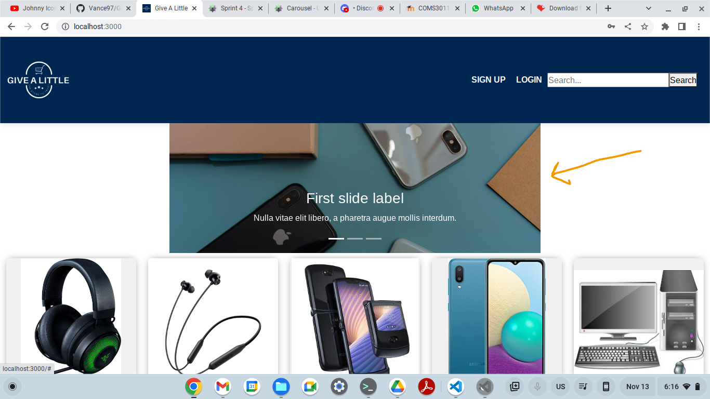

# GiveALittle E-commerce Project

GiveALittle is an e-commerce web application developed using ReactJS, HTML, and CSS. It allows users to register, log in, purchase and sell second-hand products online. The project was developed over a period of 3 months and involved the following contributors:

1. Faith Mogkalaka
2. Olwethu Goniwe
3. Vance Muchongo
4. Thibello Khaile
5. Aubrey Nalane

## Features

### Sprint 1

- LoginPage
- SignUpPage
- HomePage
- CartPage

### Sprint 2

- Add Product
- Search
- Animation on Product Hover
- Individual Product Pop-up on-Click
- Payment Method Via Stripe Integrated
- Unit Tests Introduced for Sign In, Add Product, and Cart Pages
- All Contributors Showing on the List
- AddProducts Page
- LogoutButton

### Sprint 3

- Wish List
- Forgot Password (not working)
- Checkout support integrated with paygate
- Cart notification color updated to green

### Sprint 4.0 Latest

- Footer on all pages now available
- Carousel for product updates on homepage now available
- Sell Point for registered users now available
- Additional personalized message on empty cart or wishlist pages
- UX improvements

## Duration

The duration of the project was 3 months.

